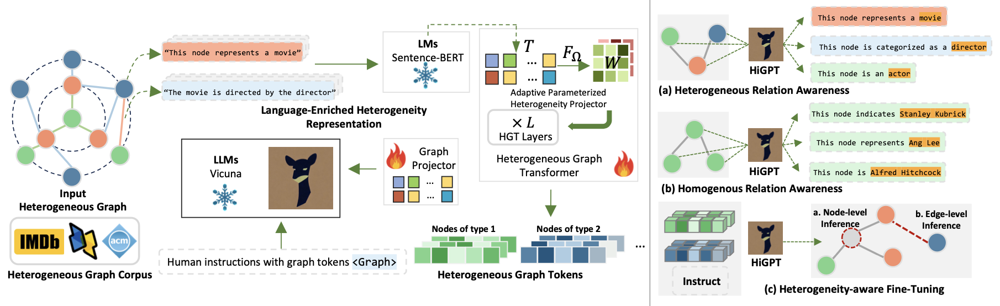

# <center>HiGPT: Heterogeneous Graph Language Model</center>

[Jiabin Tang](https://tjb-tech.github.io/), [Yuhao Yang](http://yuh-yang.github.io), [Wei Wei](#), [Lei Shi](#), [Long Xia](#), [Dawei Yin](https://www.yindawei.com/) and [Chao Huang](https://sites.google.com/view/chaoh/home)*.
(*Correspondence )

**[Data Intelligence Lab](https://sites.google.com/view/chaoh/home)@[University of Hong Kong](https://www.hku.hk/)**, Baidu Inc.

-----

<a href='https://HiGPT-HKU.github.io/'></a>
<a href='#'></a> 
<a href='https://arxiv.org/abs/2402.16024'></a> 
[](#)
 • 🌐 <a href="https://mp.weixin.qq.com/s/rvKTFdCk719Q6hT09Caglw" target="_blank">中文博客</a>


This repository hosts the code, data and model weight of **HiGPT**.

-----------

## 🎉 News 


🎯🎯📢📢 We have made significant updates to the **models** used in our HiGPT on 🤗 **Huggingface**. We highly recommend referring to the table below for further details: 

| 🤗 Huggingface Address                          | 🎯 Description                                                |
| ---------------------------------------------- | ------------------------------------------------------------ |
| https://huggingface.co/Jiabin99/In-Context-HGT | The trained in-context heterogeneous graph tokenizer using our lightweight text-graph contrastive alignment. |
| https://huggingface.co/Jiabin99/HiGPT          | It's the checkpoint of our HiGPT based on Vicuna-7B-v1.5 tuned on 60 shots IMDB graph instruction data. |


- [x] [2024.02.24]🔥🔥Release our utilized Instruction data.
- [x] [2024.02.24]🔥🔥Release checkpoints of our HiGPT and pre-trained graph encoder.
- [x] [2024.02.24] 🚀🚀 Release the code of HiGPT.


## 👉 TODO 
- [ ] Supporting lightning training
- [ ] Releasing the Chinese version of the explanation
- [ ] Releasing the full paper of our HiGPT
- [ ] Exploring the potential of our HiGPT for more graph learning tasks.
- [ ] ...

-----------


<span id='introduction'/>

## Brief Introduction 

we present the **HiGPT** framework that aligns LLMs with heterogeneous graph structural knowledge with a heterogeneous graph instruction tuning paradigm.



* **In-Context Heterogeneous Graph Tokenizer.** To achieve adaptability in a wide range of heterogeneous graph sce- narios with varying node and edge types, we introduce the in- context heterogeneous graph tokenizer. This tokenizer captures the diverse semantic relationships found in different heterogeneous graphs, providing a unified approach. To optimize performance and integrate the tokenizer seamlessly into the HiGPT framework, we employ pre-training with a lightweight text-graph contrastive alignment paradigm. For pretraining details, please refer to [[./HG_grounding]](./HG_grounding/README.md). 
* **Heterogeneous Graph Instruction-Tuning.** We intro- duce a novel heterogeneous graph instruction-tuning framework that integrates inter-type and intra-type token matching tasks to fine-tune large language models (LLMs). Our framework specifically targets the enhancement of LLMs’ understanding of both hetero- geneous relation awareness and homogeneous relation awareness. By utilizing these tasks, our aim is to bolster the LLMs’ capabilities in the following areas: (i) distinguishing between different types of graph tokens, (ii) comprehending intricate relationships within heterogeneous graphs, (iii) preserving the distinctive attributes of entities within homogeneous graphs, and (iv) effectively harnessing diverse graph instructions during the training process. Please refer to <a href='#Usage'>Getting Started </a> to explore more. 
* **Mixture-of-Thought Augmentation.** Our approach introduces a novel mechanism for augmenting graph instructions, emphasizing the use of Mixture-of-Thought (MoT) combined with various prompting techniques. This integration enables us to gen- erate a diverse and comprehensive set of informative task-specific instructions. By seamlessly incorporating these augmented graphinstructions into our framework, we anticipate that our model en- hancement will effectively address the challenge of data sparsity. For prompting examples, please refer to [[./mot_prompting]](./mot_prompting/README.md). 


For more technical details, kindly refer to the [paper](#) and the project [website](https://HiGPT-HKU.github.io/) of our Graph. 


-----------

<span id='Usage'/>

## Getting Started

<span id='all_catelogue'/>

### Table of Contents:
* <a href='#Environment Preparation'>1. Environment Preparation </a>
* <a href='#Data Preparation'>2. Data Preparation </a>
* <a href='#Training HiGPT'>3. Training HiGPT </a>
  * <a href='#Offline Heterogeneous Graph Tokenizing'>3.0. Offline Heterogeneous Graph Tokenizing</a>
  * <a href='#Prepare Pre-trained Checkpoint'>3.1. Prepare Pre-trained Checkpoint</a>
  * <a href='#Self-Supervised Instruction Tuning'>3.2. Instruction Tuning with Heterogeneous Graph Corpus</a>
  * <a href='#Extract the Trained Projector'>3.3. Extract the Trained Projector</a>
  * <a href='#Task-Specific Instruction Tuning'>3.4. Heterogeneity-aware Fine-tuning</a>
* <a href='#Evaluating HiGPT'>4. Evaluating HiGPT</a>
  * <a href='#Preparing Checkpoints'>4.1. Preparing Checkpoints</a>
  * <a href='#Running Evaluation'>4.2. Running Evaluation</a>

****


<span id='Environment Preparation'/>


### 1. Environment Preparation  <a href='#all_catelogue'>[Back to Top]</a>
Please first clone the repo and install the required environment, which can be done by running the following commands:
```shell
conda create -n higpt python=3.8

conda activate higpt

# Torch with CUDA 11.7
pip install torch==1.13.0+cu117 torchvision==0.14.0+cu117 torchaudio==0.13.0 --extra-index-url https://download.pytorch.org/whl/cu117
# To support vicuna base model
pip3 install "fschat[model_worker,webui]"
# To install pyg and pyg-relevant packages
pip install torch_geometric
pip install pyg_lib torch_scatter torch_sparse torch_cluster torch_spline_conv -f https://data.pyg.org/whl/torch-1.13.0+cu117.html
# Clone our HiGPT
git clone https://github.com/HKUDS/HiGPT.git
cd HiGPT
# Install required libraries
pip install -r requirements.txt
```

<span id='Data Preparation'/>


### 2. Data Preparation  <a href='#all_catelogue'>[Back to Top]</a>

The tuning data of our HiGPT consists of two parts, i.e., heterogeneous graph corpus (stage 1) and heterogeneity-aware graph instruction (stage 2). You can `cd hi_datasets` and run `sh get_stage1_data.sh` to download the data in **stage 1**:

```shell
cd /path/to/HiGPT/hi_datasets

wget https://archive.org/download/higpt_stage1/matching_instruction.tar.gz

tar -xzvf matching_instruction.tar.gz

rm -f matching_instruction.tar.gz
```

Also, you can run `sh get_stage1_data.sh` to download the data in **stage 2**:

```shell
cd /path/to/HiGPT/hi_datasets

mkdir stage2_data
cd stage2_data

wget https://archive.org/download/higpt_stage2/instruct_ds_dblp.tar.gz
wget https://archive.org/download/higpt_stage2/processed_dblp.tar.gz
wget https://archive.org/download/higpt_stage2/instruct_ds_imdb.tar.gz
wget https://archive.org/download/higpt_stage2/processed_imdb.tar.gz
wget https://archive.org/download/higpt_stage2/instruct_ds_acm.tar.gz
wget https://archive.org/download/higpt_stage2/processed_acm.tar.gz

mkdir DBLP
mkdir IMDB
mkdir acm

tar -xzvf instruct_ds_dblp.tar.gz -C DBLP
tar -xzvf processed_dblp.tar.gz -C DBLP
tar -xzvf instruct_ds_imdb.tar.gz -C IMDB
tar -xzvf processed_imdb.tar.gz -C IMDB
tar -xzvf instruct_ds_acm.tar.gz -C acm
tar -xzvf processed_acm.tar.gz -C acm

rm -f instruct_ds_dblp.tar.gz
rm -f processed_dblp.tar.gz
rm -f instruct_ds_imdb.tar.gz
rm -f processed_imdb.tar.gz
rm -f instruct_ds_acm.tar.gz
rm -f processed_acm.tar.gz
```

<span id='Training HiGPT'/>

### 3. Training HiGPT <a href='#all_catelogue'>[Back to Top]</a>

HiGPT tuning paradigm consists of two stages: (1) instruction tuning with heterogeneous graph corpus; (2) heterogeneity-aware fine-tuning.

<span id='Offline Heterogeneous Graph Tokenizing'/>

#### 3.0. Offline Heterogeneous Graph Tokenizing  <a href='#all_catelogue'>[Back to Top]</a>

Since the graph tokenizer does not update parameters during the two training processes, we use the Offline Heterogeneous Graph Tokenizing method to preprocess the instruction data in order to accelerate the speed of model training. The data downloaded in <a href='#Data Preparation'>Data Preparation </a> has been processed with a pre-trained graph tokenizer. If you need to process with your own graph tokenizer, you can refer to the following commands:

* processing a single instruction file and its corresponding graph data ([run_graph_tokenizer_single.sh](scripts/tune_script/run_graph_tokenizer_single.sh)): 

```shell
cd /path/to/HiGPT

ann_path=./hi_datasets/stage2_data/IMDB/instruct_ds_imdb/ann/IMDB_test_std_0_1000.json
data_type=imdb
graph_path=./hi_datasets/stage2_data/IMDB/instruct_ds_imdb/graph_data/test

python run_offline_hgt_tokenizer_single.py --ann_path ${ann_path} \
                                 --data_type ${data_type} \
                                 --graph_path ${graph_path}
```

* processing instruction files within a directory and their corresponding graph data ([run_graph_tokenizer.sh](scripts/tune_script/run_graph_tokenizer.sh)): 

```shell
cd /path/to/HiGPT

# offline tokenizing for stage1 matching instruction
data_type=imdb
graph_root=./hi_datasets/matching_instruction
dsname_list=(instruct_ds_matching_movie instruct_ds_node_matching)
pretrained_hgt=./MetaHGT_imdb_dblp_epoch5

for dsname in "${dsname_list[@]}"
do
    python run_offline_hgt_tokenizer.py --dsname ${dsname} \
                                 --data_type ${data_type} \
                                 --pretrained_gnn_path ${pretrained_hgt} \
                                 --graph_root ${graph_root}
done

data_type=dblp
graph_root=./hi_datasets/matching_instruction
dsname_list=(instruct_ds_matching_author instruct_ds_matching_paper instruct_ds_node_matching)
pretrained_hgt=./MetaHGT_imdb_dblp_epoch5

for dsname in "${dsname_list[@]}"
do
    python run_offline_hgt_tokenizer.py --dsname ${dsname} \
                                 --data_type ${data_type} \
                                 --pretrained_gnn_path ${pretrained_hgt} \
                                 --graph_root ${graph_root}
done
```

<span id='Prepare Pre-trained Checkpoint'/>

#### 3.1. Preparing Pre-trained Checkpoint  <a href='#all_catelogue'>[Back to Top]</a>
HiGPT is trained based on following excellent existing models.
Please follow the instructions to prepare the checkpoints.

- `Vicuna`:
  Prepare our base model Vicuna, which is an instruction-tuned chatbot and base model in our implementation. Please download its weights [here](https://github.com/lm-sys/FastChat#model-weights). We generally utilize v1.1 and v1.5 model with 7B parameters.
- `Pretrained Graph Tokenizer`:
  is used to encode heterogeneous graph structures. We employ text-graph grounding approach to obtain the pre-trained heterogeneous graph transformer model, which you could download by [heterogeneous graph transformer](https://huggingface.co/Jiabin99/In-Context-HGT) and put it at [[./HiGPT]](./HiGPT). We also provide source codes for text-graph grounding at [[./HG_grounding]](./HG_grounding/README.md) for your reference.

<span id='Self-Supervised Instruction Tuning'/>

#### 3.2. Instruction Tuning with Heterogeneous Graph Corpus  <a href='#all_catelogue'>[Back to Top]</a>

You could start the first stage tuning by filling blanks at [higpt_stage_1.sh](scripts/tune_script/higpt_stage_1.sh). There is an example as below: 

```shell
# to fill in the following path to run the first stage of our HiGPT!
#!/bin/bash
cd /path/to/HiGPT

data_path=instruct_ds_matching_author,instruct_ds_matching_movie,instruct_ds_matching_paper,instruct_ds_node_matching,instruct_ds_node_matching_imdb
graph_root=./hi_datasets/matching_instruction
output_dir=./checkpoints/higpt-metahgt-stage1-7b-dblp-imdb-epoch1
base_model=/path/to/vicuna-7b-v1.5-16k

wandb offline

python3.8 -m torch.distributed.run --nnodes=1 --nproc_per_node=4 --master_port=20001 \
    higpt/train/train_hete_nopl.py \
    --model_name_or_path ${base_model} \
    --version v1 \
    --data_path ${data_path} \
    --graph_content /root/paddlejob/workspace/env_run/llm/GraphChat/playground/data/arxiv_ti_ab.json \
    --graph_root ${graph_root} \
    --graph_tower ${graph_tower} \
    --tune_graph_mlp_adapter True \
    --graph_select_layer -2 \
    --use_graph_start_end True \
    --bf16 False \
    --output_dir ${output_dir} \
    --num_train_epochs 1 \
    --per_device_train_batch_size 1 \
    --per_device_eval_batch_size 1 \
    --gradient_accumulation_steps 1 \
    --evaluation_strategy "no" \
    --save_strategy "steps" \
    --save_steps 2400 \
    --save_total_limit 1 \
    --learning_rate 2e-5 \
    --weight_decay 0.0001 \
    --warmup_ratio 0.03 \
    --lr_scheduler_type "cosine" \
    --logging_steps 1 \
    --tf32 True \
    --model_max_length 2048 \
    --gradient_checkpointing True \
    --lazy_preprocess True \
    --report_to wandb \
    --hetero_key_path /root/paddlejob/workspace/env_run/output/sample_instruct_ds/ann/hetero_key_order.json
```

<span id='Extract the Trained Projector'/>

#### 3.3. Extract the Trained Projector  <a href='#all_catelogue'>[Back to Top]</a>

We could extract the trained projector in the stage 1 by filling blanks at [extract_projector.sh](scripts/tune_script/extract_projector.sh). There is an example as below: 

```shell
# to fill in the following path to extract projector for the first tuning stage!
#!/bin/bash
cd /path/to/HiGPT
stage1_model=./checkpoints/higpt-metahgt-stage1-7b-dblp-imdb-epoch1
graph_projector=./checkpoints/higpt_stage1_projector_metahgt_dblp_imdb_epoch1/higpt-metahgt-stage1-7b.bin

python3.8 ./scripts/extract_graph_projector.py \
  --model_name_or_path ${stage1_model} \
  --output ${graph_projector}
```

<span id='Task-Specific Instruction Tuning'/>

#### 3.4. Heterogeneity-aware Fine-tuning  <a href='#all_catelogue'>[Back to Top]</a>

You could start the second stage tuning based on different number of shots (e.g., 1, 3, 5, 10, 20, 40, 60) by filling blanks at [higpt_stage_2.sh](scripts/tune_script/higpt_stage_2.sh). There is an example as below: 

```shell
# to fill in the following path to run the second stage of our HiGPT!
#!/bin/bash
cd /path/to/HiGPT
base_model=/path/to/vicuna-7b-v1.5-16k
graph_root=./hi_datasets/stage2_data/IMDB
graph_projector=./checkpoints/higpt_stage1_projector_metahgt_dblp_imdb_epoch1/higpt-metahgt-stage1-7b.bin

num_epochs=15
num_shot_list=(1 3 5 10 20 40 60)
for num_shot in "${num_shot_list[@]}"
do
    python3.8 -m torch.distributed.run --nnodes=1 --nproc_per_node=4 --master_port=20010 higpt/train/train_hete_nopl.py \
    --model_name_or_path ${base_model} \
    --version v1 \
    --data_path instruct_ds_imdb \
    --graph_content /root/paddlejob/workspace/env_run/llm/GraphChat/playground/data/arxiv_ti_ab.json \
    --graph_root ${graph_root} \
    --graph_tower MetaHGT_imdb_dblp_epoch5 \
    --pretrain_graph_mlp_adapter ${graph_projector} \
    --tune_graph_mlp_adapter True \
    --graph_select_layer -2 \
    --use_graph_start_end True \
    --bf16 False \
    --output_dir ./checkpoints/higpt-stage2-imdb-metahgt-epoch${num_epochs}-mixcot-true-${num_shot} \
    --num_train_epochs ${num_epochs} \
    --per_device_train_batch_size 1 \
    --per_device_eval_batch_size 1 \
    --gradient_accumulation_steps 1 \
    --evaluation_strategy "no" \
    --save_strategy "steps" \
    --save_steps 2400 \
    --save_total_limit 1 \
    --learning_rate 2e-5 \
    --weight_decay 0.0001 \
    --warmup_ratio 0.03 \
    --lr_scheduler_type "cosine" \
    --logging_steps 1 \
    --tf32 True \
    --model_max_length 2048 \
    --gradient_checkpointing True \
    --lazy_preprocess True \
    --report_to wandb \
    --hetero_key_path /root/paddlejob/workspace/env_run/output/sample_instruct_ds/ann/hetero_key_order.json \
    --num_shot ${num_shot} 
done

```


<span id='Evaluating HiGPT'/>

## 5. Evaluating HiGPT  <a href='#all_catelogue'>[Back to Top]</a>

<span id='Preparing Checkpoints'/>


#### 5.1. Preparing Checkpoints <a href='#all_catelogue'>[Back to Top]</a>

**Checkpoints:** You could try to evaluate HiGPT by using your own model or our released checkpoints.

<span id='Running Evaluation'/>

#### 5.2. Running Evaluation <a href='#all_catelogue'>[Back to Top]</a>

* You could evaluate our HiGPT by filling blanks at [higpt_info_imdb_cot.sh](scripts/eval_script/higpt_info_imdb_cot.sh). There is an example as below: 

```shell
# to fill in the following path to extract projector for the second tuning stage!
#!/bin/bash
cd /path/to/HiGPT
output_model=./checkpoints
datapath=./hi_datasets/stage2_data/IMDB
res_path=./output_res_imdb
num_epochs=15
num_shot_list=(1 3 5 10 20 40 60)
for num_shot in "${num_shot_list[@]}"
do
  for ((cot_case=0; cot_case<=0; cot_case++))
  do
    python3.8 ./higpt/eval/run_higpt.py --model-name ${output_model}/higpt-stage2-imdb-metahgt-epoch${num_epochs}-mixcot-true-${num_shot}  --prompting_file ${datapath}/instruct_ds_imdb/ann_processed_MetaHGT_imdb_dblp_epoch5/cot_test/IMDB_test_std_0_1000_cot_${cot_case}.json --graph_root ${datapath} --output_res_path ${res_path}/imdb_test_res_epoch_${num_epochs}_std_${num_shot}_shot_cot_${cot_case} --start_id 0 --end_id 1000 --num_gpus 4
  done
done
```
* You could evaluate our HiGPT using the **Graph In-Context Learning** (**Graph ICL**) by filling blanks at [hetegpt_info_imdb_cot_incontext.sh](scripts/eval_script/hetegpt_info_imdb_cot_incontext.sh). There is an example as below: 

```shell
#!/bin/bash
cd /path/to/HiGPT
output_model=./checkpoints
datapath=./hi_datasets/stage2_data/IMDB
res_path=./output_res_imdb
num_epochs=15
num_shot_list=(1 3 5 10 20 40 60)
cot_case_list=(0)
incontext_dir=in_context_1_shot
for num_shot in "${num_shot_list[@]}"
do
  for cot_case in "${cot_case_list[@]}"
  do
    python3.8 ./higpt/eval/run_higpt_incontext.py --model-name ${output_model}/hetegpt-stage2-imdb-metahgt-epoch${num_epochs}-mixcot-true-${num_shot}  --prompting_file ${datapath}/instruct_ds_imdb/ann_processed_MetaHGT_imdb_dblp_epoch5/${incontext_dir}/IMDB_test_std_0_1000_cot_${cot_case}_in_context.json --graph_root ${datapath} --output_res_path ${res_path}_${incontext_dir}/imdb_test_res_epoch_${num_epochs}_std_${num_shot}_shot_cot_${cot_case} --start_id 0 --end_id 1000 --num_gpus 4
  done
done

```


---------


## Contact

For any questions or feedback, feel free to contact [Jiabin Tang](mailto:jiabintang77@gmail.com).


## Citation

If you find HiGPT useful in your research or applications, please kindly cite:
```tex
@articles{tang2024higpt,
title={HiGPT: Heterogeneous Graph Language Model}, 
author={Jiabin Tang and Yuhao Yang and Wei Wei and Lei Shi and Long Xia and Dawei Yin and Chao Huang},
year={2024},
eprint={2402.16024},
archivePrefix={arXiv},
primaryClass={cs.CL}
}
```


## Acknowledgements
You may refer to related work that serves as foundations for our framework and code repository, 
[Vicuna](https://github.com/lm-sys/FastChat), [LLaVa](https://github.com/haotian-liu/LLaVA), [GraphGPT](https://github.com/HKUDS/GraphGPT), We also partially draw inspirations from [MiniGPT-4](https://github.com/Vision-CAIR/MiniGPT-4). The design of our website and README.md was inspired by [NExT-GPT](https://next-gpt.github.io/). Thanks for their wonderful works.


