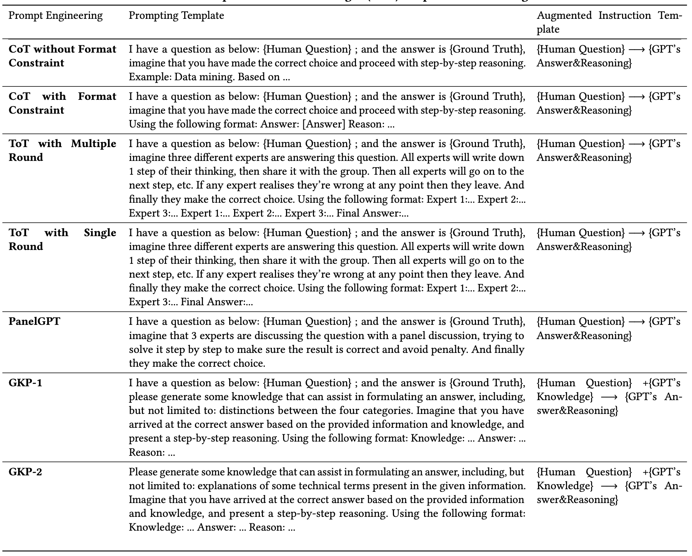

# Prompting examples of Mixture-of-Thought Graph Instruction Augmentation

We provide prompting examples of Mixture-of-Thought graph instruction augmentation for there different datasets, i.e., IMDB, DBLP and ACM. 



For example, we can run the following instructions to obtain `CoT without Format Constraint` augmentation on IMDB datasets: 

```shell
cd /path/to/HiGPT/mot_prompting/

python imdb/get_imdb_des_prompt_cot_knowledge.py --start_idx 0 --end_idx 400 --cot_case 0

# cot_case
# 0: `CoT without Format Constraint`
# 1: `CoT with Format Constraint`
# 2: `ToT with Multiple Round`
# 3: `ToT with Single Round`
# 4: `PanelGPT`
# 5: `GKP-1`
# 6: `GKP-2`
```


